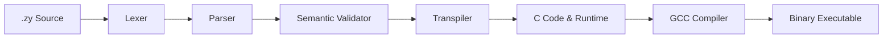

# Designing Zyay: A Quantum-Inspired Programming Language 🌀


What if your programming language didn't just execute line-by-line in a predictable way, but instead worked like quantum physics? What if variables held a superposition of states, and running code explored multiple paths simultaneously before collapsing to the best answer?

This is **Zyay** (pronounced *Zee-aye*), a quantum-inspired language I built from scratch. In this article, we'll dive deep into the formal specifications, compiler internals, runtime arena memory managers, and unique paradigms that make this language unlike anything else.

<!-- more -->

---
<a href="https://github.com/ajax-y/zyay" class="github-card" target="_blank" rel="noopener"><div class="github-card-content"><div class="github-card-icon">📁</div><div class="github-card-info"><h4>ajax-y/zyay</h4><p>A Quantum‑inspired programming language with parallel wave superposition paths, variable entanglement, error tunneling, and arena allocators.</p></div></div><div class="github-card-action">View on GitHub ➔</div></a>
---

## 💡 The Core Philosophy: "Intent over Procedure"

In classic programming languages (like Python, C, or Java), you write precise, sequential instructions telling the CPU exactly how to find an answer. You manage the loops, condition blocks, and storage registers.

In **Zyay**, the paradigm shifts. The programmer defines **intent** (what they want the outcome to look like) and constructs **superpositions** (all possible values a variable could hold). The language runtime then executes parallel paths, scoring each potential solution before executing a **measurement collapse** to return the single best result.

---

## ⚡ Unique Quantum Constructs in Zyay

Zyay implements several fundamental principles of quantum mechanics directly as language keywords:

| Keyword | Quantum Counterpart | What it accomplishes |
| :--- | :--- | :--- |
| `wave` | Superposition | Spawns a parallel search space across an iterable range or collection. |
| `entangle` | Entanglement | Locks two variables together so they share a single physical memory address. |
| `prune` | Wave Interference | Discards a branch or halts execution path when constraints are violated. |
| `tunnel` | Quantum Tunneling | Allows operations to pass safely through runtime signals (like Division-by-Zero). |
| `amplify` | Phase Amplitude | Adjusts the probability weight or score of the active execution path. |
| `observe` | Measurement | Captures a state inside a wave loop; terminates the wave and collapses to the highest-scored path. |

### 1. Superposition & Wave Collapsing (`wave` & `observe`)
A `wave` statement doesn't loop sequentially. It places the iterator into a superposition of all possible indices. When compilation targets multi-threaded execution, these branches execute in parallel paths:

```rust
// Create a superposition across numbers 0 through 9
wave i in range(0, 10):
    // Inside the wave, we test a criteria
    if i % 2 == 0:
        amplify(2.0) // Double the score weight of even numbers
    
    observe(i * i) // Record the squared result for this path
```
When the `wave` finishes, it automatically collapses and outputs only the highest-scored observed item to the user.

### 2. Quantum Entanglement (`entangle`)
In Zyay, the `entangle` keyword links two variable declarations. They do not merely point to the same object reference; their physical underlying memory addresses are permanently tied together at runtime:

```rust
var x = 10
var y = 20

entangle x <=> y

x = 99
print(y) // Prints 99! Both share the exact same physical slot.
```

### 3. Error Tunneling (`tunnel`)
In standard programming, dividing by zero causes the Operating System to trigger a hardware interrupt (`SIGFPE`), immediately crashing your application with a Core Dump. In Zyay, we can use **tunneling** to safely pass through the barrier:

```rust
var result = 0
tunnel arithmetic_error:
    result = 100 / 0 // Usually crashes
    
print(result) // Prints 0 (or default state) instead of crashing!
```

---

## 🛠️ Deep Dive into the Compiler Internals

The Zyay Compiler (`zyayc`) is built fully from scratch in Python with zero external dependencies, rendering it lightweight and fast. It compiles your code using a multi-phase system:



### Phase 1: The Tokenizing Lexer (`lexer.py`)
The lexer reads the raw text, ignores comments, tracks Python-style indentations and dedents, and groups characters into typed Token structures (like `TOKEN_KEYWORD`, `TOKEN_IDENTIFIER`, `TOKEN_LITERAL`).

### Phase 2: The AST Parser (`parser.py`)
Using a recursive-descent parsing strategy, the parser converts the flat list of tokens into a highly structured **Abstract Syntax Tree (AST)**. Each node represents a structural operation (like a variable assignment, a wave loop, or a logic branch).

### Phase 3: Semantic Validator (`validator.py`)
The validator enforces compiler safety before writing code. It audits for type mismatches, variable scopes, and warns you with custom errors:
- `E011` (Type Mismatch)
- `E031` (Division By Zero check)
- `E052` (Self-Entanglement check)

### Phase 4: The Transpiler & C Runtime (`transpiler.py` & `runtime/`)
The transpiler translates the validated AST map directly into standard ANSI C. It links in our custom C Runtime headers (`zyay_runtime.h`), which implements:
*   **The Arena Memory Allocator:** Rather than calling standard `malloc` and `free` for every heap operation (which slows execution and fragments memory), Zyay allocates memory in big chunks (Arenas). When a wave path is pruned or terminates, the entire arena is wiped in one operation, giving zero-overhead garbage collection.
*   **Multi-threading:** Leverages standard C `pthread` libraries to execute wave paths in parallel across CPU cores.

---

## 🚦 How to Build and Run Your Own Language
The Zyay compiler is ready for compilation on Linux, macOS, or Windows Subsystem for Linux (WSL).

1.  **Clone the Repository:**
    ```bash
    git clone https://github.com/ajax-y/zyay.git
    cd zyay
    ```
2.  **Write a Program (`hello.zy`):**
    ```rust
    print("Hello from the Zyay Quantum space!")
    ```
3.  **Compile and Run:**
    ```bash
    python3 -m zyayc.zyayc hello.zy
    ./hello
    ```

Zyay demonstrates that programming languages don't have to be rigid or traditional. By experimenting with quantum mechanical models, we can explore innovative ways to build memory-safe, parallel, and robust software architectures!
